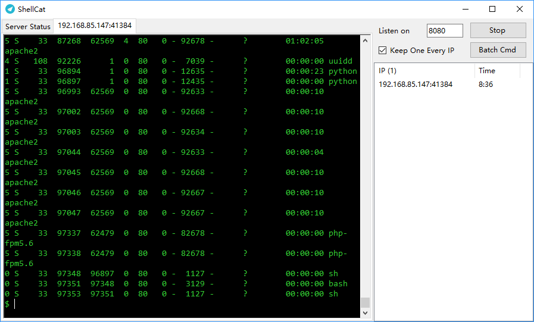

# ShellCat

一个集中管理反弹 Shell 的程序，监听一个端口，然后所有的反弹 Shell 都连到这个端口。

如果同时有很多服务器的反弹 Shell 要连，就要开很多个 nc 监听，这样会很麻烦，因此就做了这个项目。

[Download ShellCat](https://github.com/restran/shellcat/releases "")

## TODO

发送命令给所有的 shell

